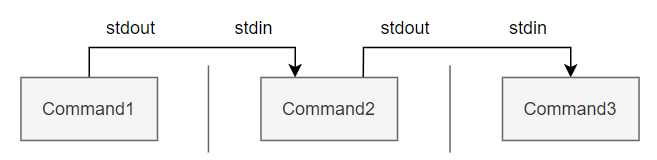

# 1. 基础

## 1.1 命令行模式

1. **登录**

   ```shell
   主机名 login: 输入账号
   Password: 输入该账号对应密码
   ```

   成功后进入

   ```shell
   [目前的用户账号@主机名 目前所在的目录]$ 
   ```

   注意：一般身份用户的提示字符如上，为$；root的提示字符为#

   **注销Linux**

   ```shell
   [xiaofengli@centos 桌面]$ exit
   ```

2. **模式切换**

   Linux默认提供六个终端给用户登录，分别为tty1 - tty6的操作接口环境

   * Ctrl + Alt + F2 ~ F6：命令行模式登录tty2 - tty6终端
   * Ctrl + Alt + F1：图形用户界面模式

3. **热键**

   | 按键       | 执行结果                     |
   | ---------- | ---------------------------- |
   | `[Tab]`    | 命令或文件名的补全           |
   | `[Ctrl]+c` | 终止当前命令                 |
   | `[Ctrl]+d` | 输入结束(`EOF`)              |
   | `[Ctrl]+m` | 回车                         |
   | `[Ctrl]+s` | 暂停屏幕输出                 |
   | `[Ctrl]+q` | 恢复屏幕输出                 |
   | `[Ctrl]+u` | 在提示字符下，将整列命令删除 |
   | `[Ctrl]+z` | 暂停当前命令                 |

## 1.2 绝对路径与相对路径

* 绝对路径：有根目录（/）开始写起

* 相对路径，开头不是/就属于相对路径写法

  ```shell
  .或者./:代表当前目录
  ..或者../:代表上一层目录
  ```

## 1.3 命令的查找顺序

1. 以相对/绝对路径执行命令，如【/bin/ls】或【./ls】
2. 由【alias】找到该命令来执行
3. 由bash内置的（`builtin`）命令来执行
4. 通过`$PATH`变量内的顺序查找到第一个命令执行

# 2. 正则表达式

## 2.1 通配符


# 3. 文件与目录管理

## 3.1 查看

```shell
ls
显示该目录下文件名
ls -a
列出所有文件（包括隐藏文件）
ls -l
列出非隐藏文件详细的权限与属性，共七个字段
```

## 3.2 权限

1. 任何文件/目录都有**用户(User)**、**所属群组(Group)**、**其他人(Others)**三种身份的权限

   所有系统上的账户和一般身份用户、以及root都记录在`/etc/passwd`中

   个人密码记录在`/etc/shadow`中

   所有的组名都记录在`/etc/group`中

2. 文件属性与权限**查看**

   ```shell
   drwxr-xr-x.  2 xiaofengli xiaofengli    6 1月   5 23:23 桌面
   [权限]     [链接][拥有者]   [用户组]    [文件容量] [修改日期][文件名]
   ```

   * 第一栏：文件的类型与权限

     ```
     第一个字符代表这个文件时目录、文件、链接文件
     [d]为目录
     [-]为文件
     [l]为链接文件
     ```

     ```
     接下来的九个字符，三个为一组，为[rwx]三个参数的组合
     [r]代表可读
     [w]代表可写
     [x]代表可执行
     没有该权限，就会出现[-]
     ```

     |      | 内容         | r                          | w                                                 | x                              |
     | ---- | ------------ | -------------------------- | ------------------------------------------------- | ------------------------------ |
     | 文件 | 具体数据data | 读到文件内容               | 修改文件内容                                      | 执行文件内容                   |
     | 目录 | 文件名       | 读到目录结构列表(如ls命令) | 改动目录结构列表(如建立/删除/更名/移动 文件/目录) | 用户是否能进入该目录(如cd命令) |

     ```
     第一组为文件拥有者的权限
     第二组为文件所属用户组的权限
     第三组为其他人的权限
     ```

   * 第二栏：有多少文件名链接到此节点

   * 第三栏：文件/目录拥有者的账号

   * 第四栏：文件所属的用户组

   * 第五栏：文件的容量大小，默认单位为Bytes

   * 第六栏：文件的创建日期或最近的修改日期

   * 第七栏：文件名，文件名前多个`.`，代表文件为隐藏文件

3. 文件属性与权限**修改**

   * 【chgrp】：修改所属用户组

     ```shell
     chgrp [-R] 用户组名称 dirname/filename
     ```

   * 【chown】：修改文件拥有者，也可顺带修改用户组

     ```shell
     chown [-R] 账号名称:用户组名称 文件或目录
     ```

   * 【chmod】：修改权限

     * 数字类型修改文件权限

       ```shell
       r:4
       w:2
       x:1
       每一组将rwx加起来即可得到该组的权限
       ```

       ```shell
       chmod [-R] 755 文件或目录
       ```

     * 符号类型修改文件权限

       ```shell
       u代表user,g代表group,o代表others,a代表全部身份
       +代表加入,-代表移除,=代表设置
       ```

       ```shell
       chmod u=rwx,g=rx,o=rx 文件或目录
       chmod a+x 文件或目录		所有人都可以执行
       ```

4. 默认权限：当前用户建立文件或目录时的权限默认值

   ```bash
   umask		# 0002
   umask -S	# u=rwx,g=rwx,o=rx
   ```

   数字为被取消的权限，加参数`-S`，则直接显示默认权限

   一般身份用户`umask`为002，保留同用户组的写入权力；`root`的`umask`默认为022

5. 特殊权限

## 3.3 复制、删除和移动

1. 复制`cp`

   ```shell
   cp [-r|-i|-p] 源文件 目标文件
   cp [-r|-i|-p] 源文件1 源文件2 ... 目录
   ```

   ```
   -r: 递归复制，用于目录复制
   -i: 目标文件已经存在，覆盖时会先询问
   -p: 连同文件的属性（权限、用户、时间）一起复制
   ```

2. 删除`rm`

   ```shell
   rm [-r|-f|-i] 文件或目录
   ```

   ```
   -r: 递归删除，用于目录删除
   -f: 强制force的意思，不会出现警告信息
   -i: 交互模式，删除前询问是否操作
   ```

3. 移动或重命名`mv`

   ```shell
   mv [-f|-i|-u] 源文件 目标文件
   mv [-f|-i|-u] 源文件1 源文件2 ... 目录
   ```

   ```
   -f: 强制force的意思，不会出现警告信息
   -i: 交互模式，删除前询问是否操作
   -u: 若目标文件已存在，且源文件比较新，才会更新
   ```

# 4. 文件

## 4.1 文件种类

1. **常规文件**

   ```bash
   file 文件名	# 观察文件类型
   ```

   * 纯文本文件(ASCII)

     内容为可以直接读到的数据，【cat 文件名】即可显示

   * 二进制文件(binary)

     系统仅可以执行二进制文件

   * 数据文件(data)

2. **目录**

3. **链接文件**

4. 设备与设备文件(device)

5. 数据接口文件(sockets)

6. 数据输送文件(FIFO, pipe)

## 4.2 文件扩展名

linux文件能否被执行，与扩展名没有关系，当权限中有x，就可以被执行，扩展名只是让你了解文件可能的用途

* `.sh`：脚本或批处理文件(scripts)
* `Z`、`.tar`、`.tar.gz`、`.zip`、`.tgz`：打包的压缩文件
* `.html`、`.php`：网页相关文件

## 4.3 查看文件内容

* `cat`：从头显示文件内容

  ```
  cat -n: 打印出行号
  ```

* `more`：一页一页翻动

  ```
  空格/回车: 向下翻一页
  q: 退出
  ```

  `less`：比`more`多出往回翻页

  ```
  [pageup]: 向上一页翻页
  ```

* `head`：取出前面几行

  ```shell
  head [-n number] 文件
  ```

  `tail`：取出后面几行

  ```shell
  tail [-n number] 文件
  ```

## 4.4 创建文件

```shell
touch 文件
```

## 4.5 查找文件

1. `which`：查找执行文件

   ```bash
   which [-a] command		# 根据【PATH】环境变量规范的路径，查找执行文件的文件名，-a列出所有找到的同名执行文件
   ```

2. 

# 5. 目录

## 5.1 FHS

`FHS`的目的是让用户了解已经安装的软件通常放到哪个目录下，它仅定义了三层目录

### 5.1.1 根目录（/）

所有的目录都是由根目录衍生而来，根目录也与启动、还原、系统修复有关

| 目录     | 应放置的文件                                                 |
| -------- | ------------------------------------------------------------ |
| `/boot`  | 存放启动时使用的文件，包括linux内核文件以及启动选项与启动所需配置文件<br />linux内核常用文件名为`vmlinuz`，若启动引导程序为`grub2`，还会有目录`/boot/grub2` |
| /bin     | 存放单人维护模式下还能够被使用的命令，可以被root和一般账号所使用，如cat等 |
| /sbin    | 存放启动过程中需要的命令，包括启动、修复、还原系统的命令     |
| `/lib`   | 存放启动时会用到的函数库，以及/bin和/sbin下的命令会调用的函数库 |
| /etc     | 存放系统主要的配置文件，如账号密码文件、各种服务的启动文件   |
| `/dev`   | 设备和接口设备都是以文件形式存在于这个目录，通过读写这个目录下的文件，就等于读写某个设备，如`/dev/null` |
| `/media` | 放置可删除的设备，包括软盘、光盘、DVD                        |
| `/mnt`   | 放置暂时挂载的额外设备                                       |
| `/tmp`   | 一般用户或正在执行的程序暂时放置文件的目录                   |

| 建议存在的目录 | 应放置文件                                                   |
| -------------- | ------------------------------------------------------------ |
| `/home`        | 系统默认的用户家目录，`~`代表目前用户的家目录，`~user`代表 user 的家目录 |
| `/root`        | 系统管理员root的家目录                                       |

### 5.1.2 /usr

`usr`为UNIX Software Resource的缩写，即UNIX操作系统软件资源放置的目录

## 5.2 特殊目录

```shell
1. .		代表此层目录
2. ..  		代表上一层目录
所有目录下面都会存在两个目录，为“.”和“..”，即此层目录和上层目录
根目录的上一层目录“..”和根目录自己“.”为同一个目录
3. -		代表前一个工作目录
4. ~		代表目前使用者所在家目录
若为root，为“/”;若为普通用户，为“/home/用户名”
5. ~account	代表account这个使用者的家目录
```

## 5.3 管理目录

```shell
1. cd(change directory)
2. pwd(print working directory)
3. mkdir(make directory)
4. rmdir(remove directory)	只能删除空目录，若目录下有东西，应用rm -r dir
```


# 6. 文件压缩

## 6.1 压缩原理

系统使用字节来计量单位，但最小的计量单位为bit，`1B=8bit`

 

* 当记录1时，1在最右边一位，其他7位自动填充0，可将没有使用到的空间【丢】出去
* 当数据为【111...】共100个1，可以记录为【100个1】而非真的100位

实质：文件里有相当多的空间并非完全填满，压缩技术就是将其填满

## 6.2 压缩命令

1. `gzip`

   扩展名为`*.gz`，源文件会被删除

   ```
   -d :解压缩
   -v :显示原文件/压缩文件的压缩比
   -# :压缩等级；-1最快，压缩比最差；默认为6
   ```

2. `bzip2`

   扩展名为`*.bz2`，参数和`gzip`一样，压缩比比`gzip`更好

3. `xz`

   扩展名为`*.xz`

   ```
   -k :保留原文件不被删除
   ```

压缩比：`xz > bzip2 > gzip`

时间：`gzip > bzip2 > xz`

## 6.3 打包

* 打包与压缩

  ```shell
  tar [-z|-j|-J] [cvf] filename.tar 要被压缩的文件或目录 
  ```

* 查看打包文件里的文件名

  ```shell
  tar [-z|-j|-J] [tvf] filename.tar
  ```

* 解压缩

  ```shell
  tar [-z|-j|-J] [xvf] filename.tar [-C 文件/目录解压缩到该文件夹]
  ```

参数

* ```
  -z :通过gzip进行压缩/解压缩，文件名最好为*.tar.gz
  -j :通过bzip2进行压缩/解压缩，文件名最好为*.tar.bz2
  -J :通过xz进行压缩/解压缩，文件名最好为*.tar.xz
  ```

* ```
  -c :建立打包文件
  -t :查看打包文件有哪些文件名
  -x :解压缩打包文件
  ```

* ```
  -v :压缩/解压缩过程中，将正在处理的文件名显示出来
  -f :后面要立刻接要被处理的文件
  -C :在特定的目录下解压缩
  ```

# 7. Bash

## 7.1 变量

【变量】分为【环境变量】和【自定义变量】，区别在于

* 父进程的自定义变量不能在子进程使用，环境变量可以在子进程使用；
* 自定义变量最好用小写，环境变量最好用大写

### 7.1.1 变量操作

* 变量设置与修改用【=】连接，等号两边不能有空格

  ```bash
  myname=xiaofengli
  ```

  双引号内的特殊字符可以保持原有特性，单引号内字符均视为一般字符

  ```bash
  var="my name is ${myname}"	#var为my name is xiaofengli
  var='my name is ${myname}'	#var为my name is ${myname}
  ```

  转义字符【\】可将特殊字符（`Enter`、`$`、`\`、`空格`等）变为一般字符

  ```bash
  myname=my\ name		#myname为my name
  ```

* 变量内容扩增用【${变量}】累加内容

  ```bash
  PATH=${PATH}:/home/bin
  ```

* 变量取消用【unset 变量名称】

  ```bash
  unset myname
  ```

* 变量内容打印

  ```bash
  echo $myname
  echo ${myname}
  ```
  
* 变量列举

  ```bash
  env		#列举环境变量
  set		#列举所有变量
  ```

* 自定义变量转成环境变量

  ```bash
  export var
  #直接执行export会将所有环境变量显示出来
  ```


### 7.1.2 环境变量

1. 【HOME】：代表用户根目录

   【SHELL】：目前环境使用的shell是哪个程序，默认为/bin/bash

   【HISTSIZE】：系统会记录执行过的命令，该值设置记录的条数，默认为1000

   【MAIL】：系统的邮箱文件

   【PATH】：执行文件查找的路径，目录与目录中间用冒号`:`隔开

   【LANG】：语系数据，通常中文编码为`zh_CN.GB2312`或`zh_CN.UTF-8`

   【RANDOM】：通过【&RANDOM】可以生成一个0-32767的数

2. 【PS1】：设置提示字符

   | 内容           | 意义                                       |
   | -------------- | ------------------------------------------ |
   | \d             | 显示【星期 月 日】                         |
   | \H, \h         | 大写显示完整主机名，小写显示主机名首字     |
   | \t, \T, \A, \@ | 显示每天的时分秒                           |
   | \u             | 显示用户账号信息                           |
   | \v             | 显示BASH版本信息                           |
   | \w, \W         | 小写显示完整目录名，大写显示最后一个目录名 |
   | \ #            | 当前执行的是第几条命令                     |
   | \ $            | 提示字符，root为#，否则为$                 |

   【$】：当前shell的进程号

   【?】：上一条执行的命令的返回值，成功为0，失败非0

## 7.2 命令别名

用来替换既有的命令

```bash
alias 别名='命令'	#设置别名
unalias 别名		 #取消别名
```

命令别名是新创一个新的命令，可以直接执行；变量则要用【echo】命令才能调用变量的内容

## 7.3 历史命令

```bash
history n		#列出最近n条命令
history -c		#清楚当前shell所有history内容
```

以bash登录后，系统会自动从家目录的`~/.bash_history`读取曾经执行的命令，读取条数=`HISTSIZE`

注销时，系统会将最近的`HISTSIZE`条记录更新到`~/.bash_history`；当多个bash界面以同一身份登录，最后注销的bash才是最后写入的数据，因为之前的都被最后一个bash覆盖掉了

## 7.4 bash环境配置文件

bash启动时会读取配置文件，包括全局系统配置文件和用户个人偏好配置文件

bash取得需要登录，登录分为`login shell`和`non-login shell`两种，是否登录读取的配置文件不同

1. `login shell`：取得bash时需要完整的登录流程，输入账号密码

   * `/etc/profile`：系统整体设置，主要有两步

     【利用用户标识符`UID`决定重要的变量】

     | 变量     |                                                        |
     | -------- | ------------------------------------------------------ |
     | PATH     | 根据`UID`决定PATH变量要不要含有`sbin`的系统命令目录    |
     | MAIL     | 根据账户设置好用户的`mailbox`到`/var/spool/mail`账号名 |
     | USER     | 根据用户账号设置此变量内容                             |
     | HOSTNAME |                                                        |
     | HISTSIZE |                                                        |
     | umask    |                                                        |

     【调用外部配置文件】

     通过`/etc/profile.d/`内的`.sh`文件，规范bash操作界面的颜色，语系，ll与ls命令别名，vi命令别名，which命令别名

     如`/etc/profile.d/lang.sh`调用`/etc/locale.conf`决定默认语系；`/etc/profile.d/bash_completion.sh`加载`/usr/share/bash-completion/completions`目录下的内容，提供命令补齐，文件名补齐，命令选项参数补齐

   * `~/.bash_profile`：读取用户个人配置文件

     

* `non-login shell`：取得bash不需要重复登录的操作

# 8. 命令

## 8.1 数据流重定向

每个 Unix/Linux 命令运行时都会打开三个文件：

- 标准输入文件(`stdin`)：`stdin`的文件描述符为0，Unix程序默认从`stdin`读取数据，`stdin`默认为键盘
- 标准输出文件(`stdout`)：`stdout`的文件描述符为1，Unix程序默认向`stdout`输出数据，`stdout`默认为屏幕
- 标准错误文件(`stderr`)：`stderr`的文件描述符为2，Unix程序会向`stderr`流中写入错误信息，`stderr`默认为屏幕

 

重定向就是将默认由键盘输入的数据改由文件来替换，默认输出到屏幕的数据分别传送到其他文件或设备

| 符号           | 说明                                                         |
| -------------- | ------------------------------------------------------------ |
| `< file`       | 将原本由键盘输入的数据，改由file替换                         |
| `1>`           | 以覆盖的方式将【正确的数据】输出到文件或设备                 |
| `1>>`          | 以累加的方式将【正确的数据】输出到文件或设备                 |
| `2>`           | 以覆盖的方式将【错误的数据】输出到文件或设备                 |
| `2>>`          | 以累加的方式将【错误的数据】输出到文件或设备                 |
| `1> file 2>&1` | 标准错误输出2先定向到标准输出1，然后将标准输出1定向到file    |
| `2> file 1>&2` | 标准输出1先定向到标准错误输出2，然后将标准错误输出2定向到file |
| `&> file`      | 标准输出与标准错误输出一起重定向                             |
| `<< "eof"`     | 将多行输入传递给交互式命令，`eof`为结束的输入字符            |

黑洞设备`/dev/null`：吃掉任何导向这个设备的信息，所以可用`2> /dev/null`丢弃`stderr`

## 8.2 连续执行命令

1. 不相关命令

   ```bash
   cmd; cmd
   ```

2. 依赖性命令

   主要体现在**后一个命令需要判断前一个命令执行是否正确**

   | 命令执行情况     | 说明                                                         |
   | ---------------- | ------------------------------------------------------------ |
   | `cmd1` && `cmd2` | 1.若`cmd1`执行完毕且正确执行（`$?=0`），则执行`cmd2`<br />2.若`cmd1`执行完毕且为错误（`$?=0`），`cmd2`不执行 |
   | `cmd1` || `cmd2` | 1.若`cmd1`执行完毕且正确执行（`$?=0`），`cmd2`不执行<br />2.若`cmd1`执行完毕且为错误（`$?=0`），开始执行`cmd2` |

   假设判断式

   ```bash
   cmd1 && cmd2 || cmd3
   ```

## 8.3 管道命令

 

* 管道命令必须能接受来自前一个命令的数据成为标准输入继续处理才行

* 管道命令仅会处理标准输出，忽略标准错误

  强制让标准错误被管道命令使用：通过数据流重定向，加入`2>&1`

1. `cut`：以【行】为单位，取出其中的一段

   ```bash
   cut -d '分隔字符' -f 第几段
   cut -d ':' -f 3, 5		# 以:分隔，取出分隔后的第三段和第五段
   ```

   `cut`的局限性：不支持指定多个字符作为分隔符

   ```bash
   cut -c i-j				# 提取指定范围内的字符
   cut -c 12-20			# 输出一行第12到20的字符
   ```

2. `grep`：一行中有需要的信息，取出该行

   ```bash
   grep 'root'		# 出现‘查找字符’就将该行取出
   grep -v 'root'	# 反向选择，显示没有‘查找字符’内容的那一行
   ```

3. `sort`：排序

   ```bash
   sort -t '分隔符'	# 以什么符号分隔，默认为[tab]
   	 -k 1		  # 以哪个区间field进行排序
   	 -n 	      # 使用【纯数字】排序，默认为文字形式排序
        -u			  # 相同的数据，仅出现一次，就是uniq
   uniq -c			  # 对sort的-u参数升级，仅出现一次的同时进行计数
   ```

4. `wc`

   ```bash
   wc -l	# 输出信息有多少行
      -w	# 输出信息有多少字
      -m	# 输出了多少字符
   ```

5. `tee`：双向重定向

   同时将数据流分送到文件与屏幕，这样的意义在于：`>`可以将数据流整个传送给文件或设备，但除非读取该文件/设备，否则无法继续利用这个数据流，`tee`可以在数据流处理过程继续使用该数据

   ```bash
   tee [-a] file	# -a以累加的方式，将数据加入file，同时屏幕也有输入信息
   ```

6. `split`：划分命令

   可以将大文件根据文件大小或行数，划分为小文件，方便携带

   ```bash
   split -b 1k file PREFIX		# 将file分成1K一个文件，小文件以PREFIXaa、PREFIXab的方式建立
   	  -l 10 file PREFIX		# 每10行分成一个文件
   ```
   

# 9. shell脚本

## 9.1 运行

