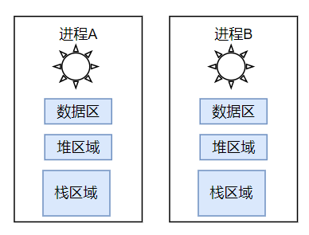
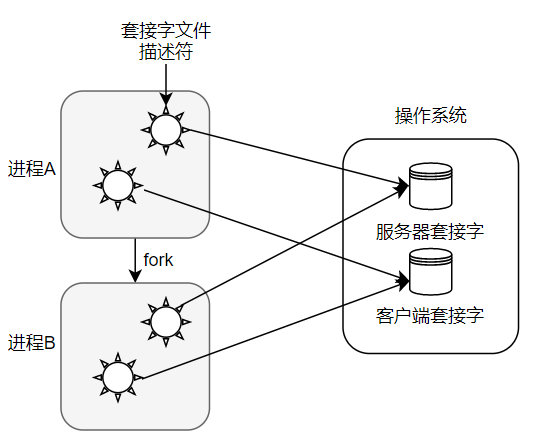
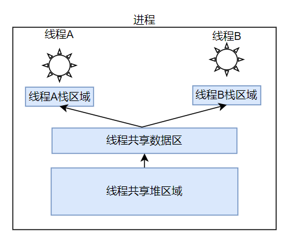

# 1. 编译调试工具

## 1.1 gcc

1. `gcc`编译程序经过4个过程：`Pre-Processing`，`Compiling`，`Assembling`，`Linking`

       

2. 【预编译】

   * 删除所有`#define`，展开宏定义

   * 处理所有条件预编译指令，如

     ```c
     #if		#ifdef		#elif	#else	#endif
     ```

   * 处理`#include`预编译指令

   * 删除所有注释，并添加行号

3. 【编译】

   现在`gcc`把预编译和编译合并为了一个步骤，用`cc1`这个程序来完成，程序位于`/usr/libexec/gcc/x86_64-redhat-linux/4.8.5/`。

   对于`c`程序为`cc1`，对于`c++`为`cc1plus`，`fortran`为`f951`

4. 【汇编】

   将汇编指令和机器指令一一翻译就行，生成目标文件

   **目标文件的重要性**：因为有时源代码文件并非只有一个，无法直接编译，只能先产生目标文件，再通过下面的链接步骤成为二进制可执行文件

5. 【链接】

   ```bash
   gcc test.c -lm -L/lib -L/lib64 -I/usr/include
   ```

   | 参数    | 作用                                           |
   | ------- | ---------------------------------------------- |
   | -l      | 加入某个函数库library                          |
   | -L/path | 上一个参数`-l`需要的函数库到后面接的路径里查找 |
   | -I/path | `include`文件去哪个目录下查找                  |

6. 参数

   | 选项 | 作用                         |
   | ---- | ---------------------------- |
   | -o   | 生成.i、.s、.o、可执行文件等 |
   | -E   | 只运行C预编译器              |
   | -S   | 编译器产生汇编文件           |
   | -c   | 取消链接步骤，生成目标文件   |
   | -g   | 加入调试信息                 |

   <font color='red'>重点</font>：

   ```
   -o 生成的文件名	//它后面只能接生成的文件名，即你生成的文件叫什么，对编译汇编链接没有任何影响
   				//如果不加它，默认生成a.out
   不加参数		 //直接一步到位，生成可执行文件而非目标文件.o
   [-E|-S|c] 待处理的文件	//这三个参数才是实际的预处理编译汇编参数
   ```

## 1.2 gdb

```bash
1.调试
	gdb ./test
2.调试运行
	run
	start
	(argc, argv)run a.txt start a.txt
3.单步执行
	n, s, ni, si
	continue	//跳转到下一断点
4.打印变量
	print/display {var1, var2}
	undisplay 编号
5.断点设置
	break location
	clear/delete

info args/locals/breakpoint/frame
backtrace
```

```
layout：用于分割窗口，可以一边查看代码，一边测试。主要有以下几种用法：
layout src: 显示源代码窗口
layout asm: 显示汇编窗口
layout regs: 显示源代码/汇编和寄存器窗口
layout split: 显示源代码和汇编窗口
layout next: 显示下一个layout
layout prev: 显示上一个layout
Ctrl + L: 刷新窗口
Ctrl + x，再按1: 单窗口模式，显示一个窗口
Ctrl + x，再按2: 双窗口模式，显示两个窗口
Ctrl + x，再按a: 回到传统模式，即退出layout，回到执行layout之前的调试窗口。
```

## 1.3 git

1. 查看本地git仓库状态的命令

   ```shell
   git status
   ```

2. 进入待提交的文件夹建立本地git仓库

   ```shell
   git init
   ```

3. 将文件提交到本地git仓库

   ```shell
   git add file
   git add .	//全部文件
   git commit -m "注释"
   ```

4. 建立与远程仓库的连接（第二次之后就不需要再建立连接了）

   ```shell
   git remote add origin githttps
   ```

5. 当远程仓库不为空时，需要获取远程库与本地同步合并

   ```shell
   git pull --rebase origin master
   ```

6. 见本地仓库内容push到远程仓库

   ```shell
   git push -u origin master	//第一次需要加参数"-u",后面再次push时就需要把该参数去掉
   ```


# 2. 系统编程

## 2.1 进程创建

每个进程的内存空间由**保存全局变量的【数据区】**，**向malloc等函数的动态分配提供空间的【堆区】**，**函数运行时使用的【栈区】**构成

每个进程都有独立空间，但需要注意，<font color='red'>套接字并非进程所有，它属于操作系统，进程只拥有代表相应套接字的文件描述符，只有所有文件描述符都销毁，才能销毁套接字</font>

 

```c
#include <unistd.h>

pid_t pid = fork();
```

调用`fork`函数后，就会产生两个进程。父子进程会继续执行下面的语句，但它们拥有完全独立的内存结构。

同时`fork`函数返回值为子进程ID时为父进程，`fork`函数返回值为0时为子进程

## 2.2 僵尸进程

子进程销毁需要将以下两种子进程产生的值传递给父进程

* 调用`exit`函数传递的参数值

* `main`函数执行`return`语句返回的值

这两个语句的结束状态值会传递给操作系统，但操作系统不会主动将其传给父进程

只有在父进程发起请求时，操作系统才会传递该值；若父进程未请求，操作系统将一直保存，子进程则处于僵尸进程状态

**销毁僵尸进程的两种方法**

1. 【wait函数】

   ```c
   #include <sys/wait.h>
   
   pid_t wait(int * statloc);
   //成功返回终止的子进程ID，失败返回-1
   ```

   调用`wait`，如果此时没有已终止的子进程，程序将阻塞

   直到有子进程终止时，将子进程终止时传递的返回值保存到该函数参数`statloc`所指的内存空间，子进程完全销毁

   并通过宏分离：`wifexited`子进程正常终止时返回true；`wexitstatus`返回子进程的返回值

   ```c
   if (WIFEXITED(status)) {
   	printf("返回值是:%d\n", WEXITSTATUS(status));
   }
   ```

2. 【waitpid函数】

   ```c
   #include <sys/wait.h>
   
   pid_t waitpid(pid_t pid, int * statloc, int options);
   //成功返回终止的子进程ID，失败返回-1
   ```

   * `pid`为等待终止的目标子进程ID，若传递-1，与`wait`相同，可等待任意子进程结束
   * `statloc`与`wait`的参数相同
   * `options`传递`sys/wait.h`中的常量`WNOHANG`

   该函数即使没有终止的子进程也不会进入阻塞状态，而是返回0并退出函数

## 2.3 信号处理

特定事件发生后操作系统向进程发送信号，进程停止当前事务调用信号处理函数

因为即使使用`waitpid`函数依然存在问题，因为调用`waitpid`还是得无休止的等待，不然接受不到子进程终止的信号

| 特定事件 | ·                                 |
| -------- | --------------------------------- |
| SIGALRM  | 已到通过调用`alarm`函数注册的时间 |
| SIGINT   | 输入`ctrl+c`                      |
| SIGCHLD  | 子进程终止                        |

**两种信号注册函数**

1. 【signal】

   ```c
   void (*signal(int signo, void (*func)(int))) (int);
   ```

   发生第一个参数代表的情况时，调用第二个参数所指的函数

   第二个参数指向的函数参数应为`int`，返回值类型应为`void`

   ```c
   #include <signal.h>
      void keycontrol(int sig) {
          if (sig == SIGINT)
              puts("ctrl+c pressed");
      }
      signal(SIGINT, keycontrol);
   ```

   产生信号时，为调用信号处理器，将唤醒由于调用sleep函数而进入阻塞状态的进程；且进程一旦被唤醒就不会再进入睡眠状态，即使未到sleep函数中规定的时间也是如此

2. 【sigaction】

   ```c
   int sigaction(int signo, const struct sigaction * act, struct sigaction * oldact);
   //成功返回0，失败返回-1
   ```

   * `signo`与`signal`函数相同，传递信号信息
   * `act`对应第一个参数的信号处理函数信息
   * `oldact`可以获得之前注册的信号处理函数指针，不需要则填0

   ```c
   struct sigaction {
       void (*sa_handler)(int);	//sa_handler保存信号处理函数的地址值
       sigset_t sa_mask;			
       int sa_flags;				//sa_mask和sa_flags初始化为0即可
   }
   ```

   **使用示例**：

   ```c
   void timeout(int sig) {
       if (sig == SIGALRM) 
           puts("time out");
       alarm(2);
   }
   
   struct sigaction act;
   act.sa_handler = timeout;
   sigemtpyset(&act.sa_mask);
   act.sa_flags = 0;
   sigaction(SIGALRM, &act, 0);
   ```

## 2.4 进程通信

每个进程拥有完全独立的内存结构，进程之间要交换数据必须通过内核，在内核中开辟一块缓冲区，进程1把数据从用户空间拷到内核缓冲区，进程2再从内核缓冲区把数据读走，内核提供的这种机制称为**进程间通信IPC**

1. 管道

## 2.5 线程创建运行

线程为保持多条代码执行流隔开了栈区域，但共享数据区和堆区

 

1. 【pthread_create】

   ```c
   #include <pthread.h>
   
   int pthread_create(
   	pthread_t * restrict thread,
       const pthread_attr_t * restrict attr,
       void * (* start_routine)(void *),
       void * restrict arg
   );
   //成功返回0，失败返回其他值
   ```

   * `thread`：保存新创建线程ID的地址
   * `attr`：传递线程属性，传`null`属性默认
   * `start_routine`：线程main函数的函数指针
   * `arg`：`start_routine`所指向的函数的参数地址
   
   当进程的main函数返回后，进程终止，线程也会一同终止
   
2. 【pthread_join】

   ```c
   #include <pthread.h>
   
   int pthread_join(pthread_t thread, void ** status);
   //成功返回0，失败返回其他值
   ```

   * `thread`：该参数代表的线程终止后，该函数才会返回
   * `status`：保存线程main函数返回值的指针变量地址

   调用该函数的进程将进入等待状态，直到第一个参数为ID的线程终止，且可以获得线程main函数返回值

   

# 3. C++

## 3.1 基本内置类型

### 3.1.1 数据类型

基本数据类型分为**算术类型**和**空类型**，算术类型分为**整型**（整型数、字符、布尔值）和**浮点型**

| 类型        | 含义           | 最小尺寸               |
| ----------- | -------------- | ---------------------- |
| bool        | 布尔类型       | 未定义                 |
| char        | 字符           | 8位                    |
| short       | 短整型         | 16位                   |
| int         | 整型           | 16位                   |
| long        | 长整型         | 32位                   |
| long long   | 长整型         | 64位                   |
| float       | 单精度浮点数   | 6位有效数字，32位      |
| double      | 双精度浮点数   | 10位有效数字，64位     |
| long double | 扩展精度浮点数 | 10位有效数字，96/128位 |

1. 基本字符类型为`char`，可以存放机器基本字符集中任意字符对应的数字值。

   其他字符类型`wchar_t`、`char16_t`、`char32_t`用于扩展字符集

2. 整型中一个`int`至少和一个`short`一样大，一个`long`至少和一个`int`一样大，一个`long long`至少和一个`long`一样大

3. **带符号型**`signed`可以表示正数、负数和0，**无符号型**`unsigned`只能表示大于等于0的数

   `short`、`int`、`long`、`long long`都是带符号型，前面加`unsigned`就是无符号型

   字符型被分为`char`、`signed char`、`unsigned char`，但表现形式只有两种：带符号和无符号，`char`由编译器决定属于哪一种，所以`char`和`signed char`不一样

### 3.1.2 字面值常量

1. 整型和浮点型字面值

   ```
   20		// 十进制
   024		// 以0开头为八进制
   0x14	// 以0x或0X开头为十六进制
   3.14159E0	//浮点型字面值表现为小数或科学计数法的指数
   ```

2. 字符和字符串字面值

   字符串字面值的类型实际为常量字符构成的数组，编译器会在每个字符串结尾处加一个空字符`'\0'`，所以字符串字面值实际长度比其内容多1

   ```
   'a'		// 字符字面值，由单引号括起来
   "Hello World"	// 字符串字面值，由双引号括起来
   ```

3. 转义序列

   有两类字符不能直接使用：①不可打印字符，如退格，因为没有可视的图符；②有特殊含义的字符，如单引号、双引号、问号、反斜线）。需要用转义序列来表示它们：

   ```
   \n	换行符			\t	横向制表符		\v		纵向制表符
   \\	反斜线			\"	双引号			 \'		 单引号
   \r	回车符			\?	问号
   ```

## 3.2 指针

指针是一个特殊变量，它里面存储的数值被解释成为内存里的一个地址，指针本身占据4个字节的长度，则可寻址空间为4GB

指针需要明白两个要素：<font color='red'>①指针所指向的类型是什么</font>；<font color='red'>②指针的值，即指针所指向的内存区或地址是什么</font>

当指针指向了一个对象后，就可以用**解引用符（*）**来访问该对象

### 3.2.1 空指针

空指针不指向任何对象，生成空指针的方法如下

```c
int *p = nullptr;	// nullptr为指针字面值
int *p = 0;
int *p = NULL;		// 这条语句需要先#include cstdlib
```

### 3.2.2 void* 指针

**void***是一种特殊指针，可用于存放任意对象的地址

`void*`作用：①指向任何类型的指针都可以赋给`void*`指针；②`void*`赋给指向其他类型的指针需要显式转换；③和别的指针比较；④作为函数输入输出

### 3.2.3 指针函数

一个返回指针的函数，即本质为一个函数，函数的返回值为指针

在调用指针函数时，需要用指向同类型的指针来接收其函数的返回值

```c++
*类型标识符 函数名(参数表);	// 声明方法，如：
int *func(int x, int y);
```

可以将其返回值定义为`void*`类型，调用时强制转换返回值为自己想要的类型

```c++
void *func(int a, int b) {
    int *c = (int *)malloc(sizeof(int));
    *c = a + b;
    return c
}
int *x = (int *)func(1, 2);
```

### 3.2.4 函数指针

指向函数类型的指针，即本质为一个指针变量，该指针指向**参数是什么返回值类型是什么**的函数

```c++
类型说明符 (*函数名)(参数);
```

函数指针需要把一个函数的地址赋给它，c++会隐式地把`func`转换成`&func`，所以可以不用加&

```c++
int func(int a);
int (*funcPtr1)(int) = &func;	//写法1
int (*funcPtr1)(int) = func;	//写法2
```


## 3.3 标准库类型

内置类型体现了计算机硬件本身具备的能力，标准库定义了一组更高级性质的类型，不能直接实现到计算机硬件

### 3.3.1 string

