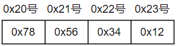
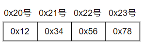

# 1、Linux文件操作

## 1.1 文件描述符(File Descriptor)

每当生成文件或套接字，操作系统都会返回分配一个整数，这个整数就是`套接字`，windows下叫`句柄`

下面三个输入输出对象即使没有创建，程序运行后也会自动分配文件描述符

| 文件描述符 | 对象                      |
| ---------- | ------------------------- |
| 0          | 标准输入：Standard Input  |
| 1          | 标准输出：Standard Output |
| 2          | 标准错误：Standard Error  |

## 1.2 打开文件

```c
#include <fcntl.h>

int open(const char *path, int flag);
//成功返回文件描述符，失败返回-1
```

`flag`为文件打开模式，多个参数通过`|`组合

| 打开模式 | 含义                       |
| -------- | -------------------------- |
| o_creat  | 必要时创建文件             |
| o_trunc  | 删除全部现有数据           |
| o_append | 维持现有数据，保存到其后面 |
| o_rdonly | 只读打开                   |
| o_wronly | 只写打开                   |
| o_rdwr   | 读写打开                   |

## 1.3 关闭文件

```c
#include <unistd.h>

int close(int fd);
//成功返回0，失败返回-1
```

## 1.4 写入数据

```c
#include <unistd.h>

ssize_t write(int fd, const void *buf, size_t nbytes);
//成功返回写入的字节数，失败返回-1
```

* `buf`为数据的缓冲地址值
* `nbytes`为传输数据字节数

```c
write(fd, buf, sizeof(buf));
```

## 1.5 读取数据

```c
ssize_t read(int fd, void *buf, size_t nbytes);
//成功返回写入的字节数，但碰到文件结尾返回0；失败返回-1
```

<font color='red'>注意：</font>`read`和`write`不同，`write`的第三个参数为传输数据的字节数，而`read`的第三个参数随便为多少，通常设为`BUF_SIZE`即可

# 2、创建套接字

```c
#include <sys/socket.h>

int socket(int domain, int type, int protocol);
//成功返回文件描述符，失败返回-1
```

* `domain`：套接字使用的协议族信息
* `type`：套接字数据传输类型信息
* `protocol`：计算机通信使用的协议信息

## 2.1 协议族

在头文件`sys/socket.h`中声明

| 名称      | 协议族               |
| --------- | -------------------- |
| PF_INET   | IPv4互联网协议族     |
| PF_INET6  | IPv6互联网协议族     |
| PF_LOCAL  | 本地通信的UNIX协议族 |
| PF_PACKET | 底层套接字协议族     |
| PF_IPX    | IPX Novell协议族     |

主要为第一个PF_INET对应的IPv4互联网协议族

## 2.2套接字类型

决定了协议族并不能决定数据传输方式，PF_INET协议族也存在多种数据传输方式

* 面向连接的套接字（`SOCK_STREAM`）

  * 传输的数据不存在数据边界

    收发数据的套接字内部有缓冲buffer，为字节数组，通过套接字传输的数据将保存到这个数组。

    所以收到数据不一定马上就要调用read函数，只要不超过数组容量，可以1次read读取全部，也可以分成多次read进行读取。

    也就是说面向连接的套接字中，read和write的调用次数没有太大意义。

  * 传输过程数据不会丢失，且按序传输数据

    首先read函数从缓冲读取数据，缓冲并不总是满的

    其次，即使read函数读取速度 < 接收数据速度，缓冲可能填满。但此时传输端套接字将停止传输，传输错误还会进行重传服务。

    所以除特殊情况，数据不会丢失。

  * 套接字连接必须一一对应

    面向连接的套接字只能和另一个同样特性的套接字连接

* 面向消息的套接字（`SOCK_DGRAM`）

  * 传输的数据存在数据边界

    接收数据的次数应和传输次数相同

  * 传输的数据可能丢失可能损毁，且强调传输速度而非传输顺序

    只要以最快速度传输就行，则每次传输的数据大小有一定限制

  * 套接字不存在连接的概念

<font color='red'>数据边界示例</font>：

* 服务器端发送一次

  ```c
  write(clnt_sock, message, sizeof(message));
  ```

* 客户端一次接收

  ```c
  read(sock, message, sizeof(message) - 1);
  ```

  客户端多次接收

  ```c
  while (read_len = read(sock, &message[idx++], 1)) {
      //具体操作
  }
  ```


## 2.3 协议

第3个参数决定了最后使用的协议，其实大部分时候传递前两个参数就可以创建套接字，因此可以向第3个参数传递0

但当**同一协议族存在多个数据传输方式相同的协议**，此时就需要第3个参数

* **IPv4网络协议族**中**面向连接的套接字**只有一个协议：`IPPROTO_TCP`

  ```c
  int tcp_socket = socket(PF_INET, SOCK_STREAM, IPPROTO_TCP);
  ```

* **IPv4网络协议族**中**面向消息的套接字**只有一个协议：`IPPROTO_UDP`

  ```C
  int udp_socket = socket(PF_INET, SOCK_DGRAM, IPPROTO_UDP);
  ```

# 3、分配套接字地址

## 3.1 地址族

IP地址分为`IPv4`（4字节地址族）和`IPv6`（16字节地址族），即差别为表示IP地址所用的字节数

下面主要使用的是`IPv4`

## 3.2 IP地址

基于IP地址的数据传输过程：

* 首先浏览4字节IP地址的`网络地址`，找到对应的路由器`Router`或交换机`Switch`
* 接收数据的路由器根据数据中的`主机地址`，向目标主机传递数据

网络地址分类：

* A类地址首位以0开始，首字节范围0~127
* B类地址前2位以10开始，首字节范围128~191
* C类地址前3位以110开始，首字节范围192~223

## 3.3 端口号

端口号：在同一操作系统内区分不同套接字，所以1个端口号只能分配给1个套接字

但TCP套接字和UDP套接字不会共用端口号，所以可以重复。如TCP套接字使用9190端口，其他TCP套接字无法使用该端口，但UDP套接字可以使用

端口号由16位构成，可分配范围0~65535。但0~1023为知名端口，一般分配给特定应用程序

## 3.4 结构体

```c
struct sockaddr_in {
    sa_family_t		sin_family;		//地址族
    in_port_t		sin_port;		//16位端口号
    struct in_addr	sin_addr;		//32位IP地址
    char			sin_zero[8];
}
struct in_addr {
    in_addr_t		s_addr;			//32位IPv4地址
}
```

`sockaddr_in`转换为`sockaddr`，则sin_zero必须填充为全0，使两个结构体保持一致

```c
struct sockaddr{
    sa_family_t		sin_family	//地址族
    char			sa_data[14]	//地址信息
}
```

1. 数据类型

   | 数据类型    | 说明                     | 声明的头文件 |
   | ----------- | ------------------------ | :----------- |
   | int8_t      | signed 8-bit int         | sys/types.h  |
   | uint8_t     | unsigned 8-bit int       |              |
   | int16_t     | signed 16-bit int        |              |
   | uint16_t    | unsigned 16-bit int      |              |
   | int32_t     | signed 32-bit int        |              |
   | uint32_t    | unsigned 32-bit int      |              |
   | sa_family_t | 地址族（address family） | sys/socket.h |
   | socklen_t   | 长度（length of struct） |              |
   | in_addr_t   | IP地址，声明为uint32_t   | netinet/in.h |
   | in_port_t   | 端口号，声明为uint16_t   |              |

2. 成员`sin_family`

   `sockaddr_in`就是保存IPv4地址信息的结构体，但结构体`sockaddr`不是只为IPv4设计，它要求在sin_family中指定地址族信息，所以保留了这个参数
   
   | 地址族（Address Family） | 含义                           |
   | ------------------------ | ------------------------------ |
   | AF_INET                  | IPv4网络协议使用的地址族       |
   | AF_INET6                 | IPv6网络协议使用的地址族       |
   | AF_LOCAL                 | 本地通信使用的UNIX协议的地址族 |
   
3. 成员`sin_port`

   主流CPU保存地址以<font color='red'>小端序</font>方式：高位字节存放到高位地址

    

   网络传输数据时使用`网络字节序`，为<font color='red'>大端序</font>：高位字节存放到低位地址（**最开始的理解**）

    

   所以在填充结构体前应将数据进行`字节序转换`

   ```c
   unsigned short htons(unsigned short)
   unsigned short ntohs(unsigned short)
   unsigned long htonl(unsigned long)
   unsigned long ntohl(unsigned long)
   ```

   其中`htons`中h代表主机（host）字节序，n代表网络（network）字节序；

   s代表short，l代表long

4. 成员`sin_addr`

   要得到32位的大端序IP地址，可以使用以下两个函数

   * ```c
     #include <arpa/inet.h>
     
     in_addr_t inet_addr(const char *string);
     //成功返回32位大端序整数型值，失败返回INADDR_NONE
     ```

   * `inet_aton`函数可以直接将生成的IP地址填到`in_addr`结构体中

     ```c
     #include <arpa/inet.h>
     
     int inet_aton(const char * string, struct in_addr * addr);
     //成功返回1，失败返回0
     ```

     和`inet_aton`相反的函数`inet_ntoa`，将网络字节序整数型IP地址转换为字符串形式

     ```c
     #include <arpa/inet.h>
     
     char * inet_ntoa(struct in_addr addr);
     //成功返回转换后的字符串地址值，失败返回-1
     ```

     该函数是在内部申请了内存并保存了字符串，未向程序员要求分配内存，再次调用会覆盖之前的

     ```c
     char * str_ptr;
     struct sockaddr_in addr;
     
     str_ptr = inet_ntoa(addr.sin_addr);
     //用指针获得申请的内存地址
     ```

## 3.5 网络地址初始化

```c
struct sockaddr_in addr;
char * serv_ip = "211.217.168.13";
char * serv_port = "9190";

memset(&addr, 0, sizeof(addr));
addr.sin_family = AF_INET;
addr.sin_addr.s_addr = inet_addr(serv_ip);
addr.sin_port = htons(atoi(serv_port));		//atoi将字符型转换为整型
```

可以使用常数`INADDR_ANY`自动获取服务器端IP地址，当计算机有多个IP地址时（因为IP地址个数和计算机安装的NIC数量相等），就可以从不同IP地址接收数据

```c
addr.sin_addr.s_addr = inet_addr(serv_ip);
=>
addr.sin_addr.s_addr = htonl(INADDR_ANY);
```

初始化网络地址分配给套接字

```c
#include <sys/socket.h>

int bind(int sockfd, struct sockaddr * myaddr, socklen_t addrlen);
//成功返回0，失败返回-1
```

```c
int serv_sock;
struct sockaddr_in serv_addr;

serv_sock = socket(PF_INET, SOCK_STREAM, 0);

//分配地址信息
bind(serv_sock, (struct sockaddr *)&serv_addr, sizeof(serv_addr));
```

# 4、处理连接请求

## 4.1 等待连接请求状态

```c
#include <sys/socket.h>

int listen(int sock, int backlog);
//成功返回0，失败返回-1
```

* `sock`为服务器端套接字，又叫监听套接字，相当于门卫
* `backlog`为连接请求等待队列长度，为`n`代表最多使`n`个连接请求进入队列，相当于等候室

## 4.2 受理连接请求

`accept`从连接请求队列队头取一个连接请求和客户端连接，返回创建的套接字文件描述符

若调用时等待队列为空，则`accept`不会返回，而是进入阻塞状态

```c
#include <sys/socket.h>

int accept(int sock, struct sockaddr * addr, socklen_t * addrlen);
//成功返回创建的套接字文件描述符，失败返回-1
```

* `sock`为服务器端套接字
* `addr`在函数调用完成后填入客户端地址信息
* `addrlen`在函数调用完成后填入客户端地址长度

## 4.3 客户端发起连接请求

```c
#include <sys/socket.h>

int connect(int sock, struct sockaddr * servaddr, socklen_t addrlen);
//成功返回0，失败返回-1
```

* `sock`为客户端套接字文件描述符
* `servaddr`为服务器端地址信息
* `addrlen`为`servaddr`地址长度

